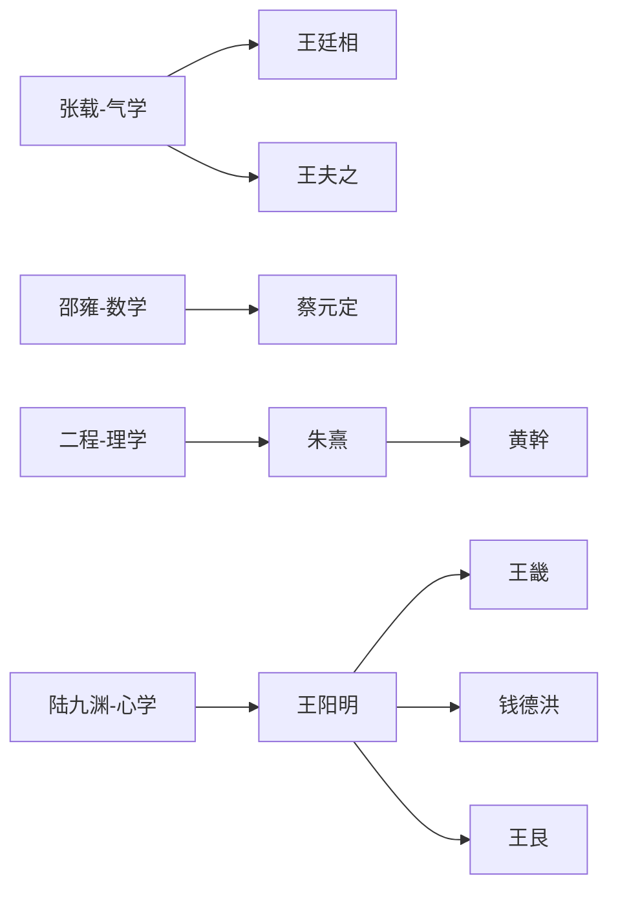

### 宋明理学发展脉络综述

以下是根据提供的记录内容整理而成的完整笔记。内容按照历史发展逻辑顺序重新编排：从起源（宋初三先生与北宋五子），到学派体系构建（四大流派），再到政治冲突（理学与新学对立），确保叙事连贯。笔记基于OCR和文本复制记录，保留原始核心含义，仅优化格式与语句连贯性，使用Markdown语法呈现。

---

#### 一、起源：宋初三先生与儒学复兴（约992—1060年）

胡瑗（993—1059）、孙复（992—1057）、石介（1005—1045）并称“宋初三先生”，活动于北宋庆历年间（1041—1048），以批判汉唐经学训诂、转向义理探索而奠基理学。其贡献与学派脉络如下：

1. **胡瑗（安定先生）**  
   - **核心思想**：倡“明体达用之学”，首创“苏湖教法”（分“经义斋”与“治事斋”），强调儒学实用性与教育革新。  
   - **弟子群体**：  
     - 程颐亲受教导于太学，胡瑗以“颜子所好何学”试诸生，程颐之答深得赏识。  
     - 范纯仁（范仲淹之子）、刘彝、孙觉、徐积等传承经世思想，刘彝提出“圣人之道，有体、有用、有文”。  
   - **历史影响**：为二程“性即理”学说提供雏形，分斋教学法被朱熹吸收为后世书院模本。胡瑗反对王安石新党的功利主义，主张以“六经”义理治国，其《周易口义》被程颐奉为经典。  
   - **生平细节**：青年时与孙复、石介同读泰山十年，后由范仲淹聘为苏州府学教授，弟子数千人。欧阳修评其“教学之法最备”，太学法沿用其制。明世宗嘉靖九年（1530年）正式从祀孔庙。

2. **孙复（泰山先生）**  
   - **核心思想**：专研《春秋》，倡“尊王攘夷”与道统论（构建“尧舜—孔孟—韩愈”谱系），批判汉唐注疏。  
   - **弟子群体**：石介承其衣钵，文彦博、祖无择等推动政治实践。  
   - **历史影响**：启导二程“天理秩序”观，张载“为天地立心”精神源于此。批判新法“舍先王之道，而独尚权谋之术”。

3. **石介（徂徕先生）**  
   - **核心思想**：师从孙复，激烈排佛老，著《怪说》《中国论》，捍卫儒学纯粹性，强调经世致用。  
   - **弟子群体**：姜潜、刘牧传易学与道统，杜默承师门气节。  
   - **学派脉络**：在山东形成“京东学派”，重《周易》象数，后被邵雍吸收；道统论为程颢“天理”本体论铺路。以《庆历圣德诗》公开褒贬士大夫。

**三先生总体贡献**：打破训诂传统，复兴先秦儒学，为理学兴起扫清障碍。教育实践（如胡瑗分斋教学）与道统构建，架起中唐韩愈至北宋五子之桥梁。

---

#### 二、开创：北宋五子与理学体系构建（约1017—1100年）

北宋五子（周敦颐、邵雍、张载、程颢、程颐）在宋初三先生基础上完成儒学哲学化转型：

1. **周敦颐（濂溪先生）**  
   - **核心地位**：朱熹尊为“道学宗主”，著《太极图说》《通书》，首创“无极而太极”宇宙生成模式，以“诚”为道德本体，融合道家宇宙论与儒家伦理。  
   - **关联三先生**：无直接师承，但受胡瑗“明体达用”启发，孙复《春秋》学强化其“宇宙秩序”观。  
   - **影响**：奠定理学宇宙论基石，程颢、程颐少年时从其问学。

2. **邵雍（康节先生）与张载（横渠先生）**  
   - **邵雍**：著《皇极经世书》，以象数学构建历史演变体系，呼应胡瑗对《周易》的重视，并吸收石介“京东学派”象数思想。  
   - **张载**：创“关学”，著《正蒙》，提出“太虚即气”“民胞物与”，其“气本论”与石介排佛立场一脉相承；受范仲淹引导读《中庸》。

3. **程颢（明道先生）与程颐（伊川先生）**  
   - **核心思想**：创“洛学”，以“天理”为最高范畴，主张“性即理”“格物致知”，程颢强调“仁者与物同体”，程颐完善“理一分殊”。  
   - **与胡瑗渊源**：程颐早年师从胡瑗，以《颜子所好何学论》回应其提问，奠定“反求诸己”思想。胡瑗称其“不求诸己而求诸外”需修正，影响程颐《伊川易传》。  
   - **影响**：完成儒学从经学到哲学转型，为朱熹集大成奠基。

**五子总体贡献**：周敦颐整合儒道，二程确立心性之学，张载与邵雍拓展宇宙论，标志理学脱离政治儒学，转向形而上学。

---

#### 三、学派体系：宋明理学四大流派发展脉络

新儒学（宋明理学）形成四大主要学派，其思想体系与历史演变如下：

## 一、学派起源与核心思想

### 1. 气学（张载为代表）
- **产生背景**：针对佛道"空无"论，重建儒家宇宙观。张载融合《周易》与道家思想。  
- **核心主张**：  
  - "太虚即气"的唯物宇宙观  
  - "一物两体"的辩证思维  
  - "民胞物与"的伦理观  
- **代表人物传承**：张载→王廷相→王夫之  

### 2. 数学（邵雍为代表）
- **产生背景**：继承汉代象数易学，融合道教先天图数传统。  
- **核心主张**：  
  - 《皇极经世》构建"元会运世"宇宙周期论  
  - 数理推演历史规律  
  - "观物"认识论  
- **代表人物传承**：邵雍→蔡元定等  

### 3. 理学（程颢、程颐、朱熹为代表）
- **产生背景**：回应佛道挑战，重构儒家形上体系。  
- **核心主张**：  
  - "理"为最高本体，"性即理"  
  - "格物致知"的认识论  
  - "存天理灭人欲"的伦理实践  
- **代表人物传承**：  
  - 北宋：二程(程颢、程颐)  
  - 南宋：朱熹→黄幹等  
  - 元代：许衡、刘因等  

### 4. 心学（陆九渊、王阳明为代表）
- **产生背景**：批判理学外在化倾向，回归孟子心性论。  
- **核心主张**：  
  - "心即理"、"致良知"  
  - "发明本心"的修养论  
  - "知行合一"的实践论  
- **代表人物传承**：  
  - 南宋：陆九渊  
  - 明代：王阳明→王畿(浙中派)/钱德洪(江右派)/王艮(泰州派)  

## 二、学派间的思想交锋与融合
### 1. 本体论之争
- **理气之辩**：朱熹提出"理在气先"调和气学与理学  
- **心理之争**：陆九渊与朱熹"鹅湖之会"的辩论  

### 2. 方法论差异
| 学派 | 认知方法 | 实践路径 |  
| ---- | -------- | -------- |  
| 理学 | 格物穷理 | 外在规范 |  
| 心学 | 反求诸心 | 内在超越 |  
| 数学 | 数理推演 | 象数运算 |  
| 气学 | 穷神知化 | 辩证思维 |  

### 3. 后期融合现象
- 王阳明吸收气学"万物一体"观  
- 朱熹晚年认可"敬中含静"的心学方法  
- 刘宗周整合心学与气学传统  

## 三、社会影响与历史演变
### 1. 政治建构
- 理学成为元明清官方意识形态  
- 科举以朱熹《四书集注》为标准  
- 朱熹"理一分殊"理论为封建等级制提供依据  

### 2. 文化塑造
- 心学推动晚明思想解放运动  
- 泰州学派发展出平民化儒学  
- 张载"横渠四句"成为士人精神标杆  

### 3. 后续发展
| 学派 | 元代     | 明代                     | 清代         |  
| ---- | -------- | ------------------------ | ------------ |  
| 理学 | 朱陆合流 | 《性理大全》确立统治地位 | 考据学冲击   |  
| 心学 | 隐伏     | 阳明后学分裂             | 颜元批判     |  
| 气学 | 边缘     | 王廷相发展               | 王夫之集大成 |  
| 数学 | 式微     | 民间易学吸收             | 黄宗羲批判   |  

## 四、核心文献与思想传承
### 1. 关键文本
- 张载《正蒙》《西铭》  
- 邵雍《皇极经世》  
- 朱熹《四书章句集注》《近思录》  
- 王阳明《传习录》  

### 2. 师承网络可视化要点

### 3. 横渠四句的现代解读
1. **为天地立心**：追求真理（求真）  
2. **为生民立命**：争取解放（解放）  
3. **为往圣继绝学**：接续孟子代表的古典社会主义传统  
4. **为万世开太平**：实践理性落实理想（毛泽东视为"致良知于天下"）  

## 五、研究方法建议
### 1. 数据采集维度
- **人物属性**：学派/年代/代表作/核心命题  
- **关系类型**：直接师承/再传/私淑/学术交往  

### 2. 可视化呈现方案
- **主视图**：力导向图按学派着色  
- **辅助视图**：  
  - 时间轴标注学派兴衰  
  - 地理热力图显示传播路径  
  - 悬停显示思想要点  

### 3. 研究价值
- 展现儒家思想最后的体系化高峰  
- 揭示中国哲学从宇宙论到心性论的转向  
- 为理解东亚现代化提供思想资源  

---

#### 四、政治冲突：理学与新学的对立（11世纪中后期）

宋代理学与王安石新学的对立，反映在胡瑗学派弟子反对新政的政治斗争中：

1. **对立背景**  
   - 新党（王安石为首）推行变法（如青苗法、市易法），主张“以法为教”和功利性改革。  
   - 旧党（司马光为首）以理学为思想基础，强调“以儒为本”和道德教化，胡瑗弟子为核心反对力量。  

2. **关键人物与事件**  
   - **钱公辅**：因弹劾王安石“强辩误国”被罢职，反映对新法激进改革的不满。  
   - **孙觉（字莘老）**：虽被王安石提拔，但因反对青苗法等政策决裂，后成旧党代表。  
   - **滕元发**：疏言“罢新法则民和天意解”，体现理学对“天人感应”的坚持。  
   - **周颖**：直言新法导致“市易青苗，一路萧条”，反映民间抵制。  
   - **刘彝**：评价胡瑗教化之功远超王安石，强调传统教育体系。  

3. **思想分野**  
   - **胡瑗学派**：继承“明体达用”，主张“体用合一”，反对新法“扰民”“非仁政”。  
   - **王安石新学**：以“经世致用”为旗帜，但被理学家批判偏离儒家“仁政”核心。  
   - 侯外庐评析：本质是封建统治集团内部改革派（新学）与保守派（理学）的思想冲突。  

4. **催化作用**  
   - **党争事件**：如乌台诗案（1079年）、元祐党争（1086—1094年），程颐遭禁促理学内省化转向。  
   - **积极影响**：学者避居书院（如嵩阳书院），加速儒学向心性之学演化，强化理学正统性。  

**历史意义**：胡瑗学派奠定理学教育基础，其与王安石的对立推动理学制度化，最终成为南宋至明清主导思想。  

> **总结**：宋初三先生扫佛老、树道统，北宋五子立天理、成心性，党争催化内省转向，四大流派蔚为大观，展现儒学哲学化高峰。