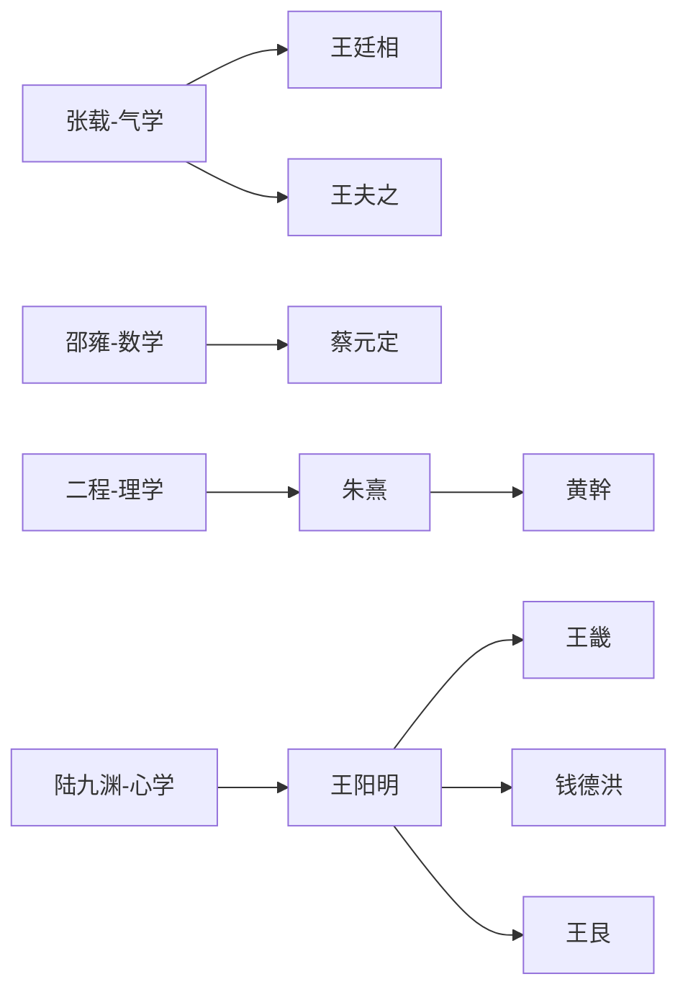

# 宋明理学四大流派发展脉络梳理

根据您提供的笔记内容，我将按照新儒学(宋明理学)的发展脉络，系统梳理四大主要学派(气学、数学、理学、心学)的思想体系与历史演变。

## 一、学派起源与核心思想

### 1. 气学（张载为代表）
- **产生背景**：针对佛道"空无"论，重建儒家宇宙观。张载融合《周易》与道家思想。
- **核心主张**：
  - "太虚即气"的唯物宇宙观
  - "一物两体"的辩证思维
  - "民胞物与"的伦理观
- **代表人物传承**：张载→王廷相→王夫之

### 2. 数学（邵雍为代表）
- **产生背景**：继承汉代象数易学，融合道教先天图数传统。
- **核心主张**：
  - 《皇极经世》构建"元会运世"宇宙周期论
  - 数理推演历史规律
  - "观物"认识论
- **代表人物传承**：邵雍→蔡元定等

### 3. 理学（程颢、程颐、朱熹为代表）
- **产生背景**：回应佛道挑战，重构儒家形上体系。
- **核心主张**：
  - "理"为最高本体，"性即理"
  - "格物致知"的认识论
  - "存天理灭人欲"的伦理实践
- **代表人物传承**：
  - 北宋：二程(程颢、程颐)
  - 南宋：朱熹→黄幹等
  - 元代：许衡、刘因等

### 4. 心学（陆九渊、王阳明为代表）
- **产生背景**：批判理学外在化倾向，回归孟子心性论。
- **核心主张**：
  - "心即理"、"致良知"
  - "发明本心"的修养论
  - "知行合一"的实践论
- **代表人物传承**：
  - 南宋：陆九渊
  - 明代：王阳明→王畿(浙中派)/钱德洪(江右派)/王艮(泰州派)

## 二、学派间的思想交锋与融合

### 1. 本体论之争
- **理气之辩**：朱熹提出"理在气先"调和气学与理学
- **心理之争**：陆九渊与朱熹"鹅湖之会"的辩论

### 2. 方法论差异
| 学派 | 认知方法 | 实践路径 |
|------|----------|----------|
| 理学 | 格物穷理 | 外在规范 |
| 心学 | 反求诸心 | 内在超越 |
| 数学 | 数理推演 | 象数运算 |
| 气学 | 穷神知化 | 辩证思维 |

### 3. 后期融合现象
- 王阳明吸收气学"万物一体"观
- 朱熹晚年认可"敬中含静"的心学方法
- 刘宗周整合心学与气学传统

## 三、社会影响与历史演变

### 1. 政治建构
- 理学成为元明清官方意识形态
- 科举以朱熹《四书集注》为标准
- 朱熹"理一分殊"理论为封建等级制提供依据

### 2. 文化塑造
- 心学推动晚明思想解放运动
- 泰州学派发展出平民化儒学
- 张载"横渠四句"成为士人精神标杆

### 3. 后续发展
| 学派 | 元代 | 明代 | 清代 |
|------|------|------|------|
| 理学 | 朱陆合流 | 《性理大全》确立统治地位 | 考据学冲击 |
| 心学 | 隐伏 | 阳明后学分裂 | 颜元批判 |
| 气学 | 边缘 | 王廷相发展 | 王夫之集大成 |
| 数学 | 式微 | 民间易学吸收 | 黄宗羲批判 |

## 四、核心文献与思想传承

### 1. 关键文本
- 张载《正蒙》《西铭》
- 邵雍《皇极经世》
- 朱熹《四书章句集注》《近思录》
- 王阳明《传习录》

### 2. 师承网络可视化要点

### 3. 横渠四句的现代解读
1. **为天地立心**：追求真理（求真）
2. **为生民立命**：争取解放（解放）
3. **为往圣继绝学**：接续孟子代表的古典社会主义传统
4. **为万世开太平**：实践理性落实理想（毛泽东视为"致良知于天下"）

## 五、研究方法建议

### 1. 数据采集维度
- **人物属性**：学派/年代/代表作/核心命题
- **关系类型**：直接师承/再传/私淑/学术交往

### 2. 可视化呈现方案
- **主视图**：力导向图按学派着色
- **辅助视图**：
  - 时间轴标注学派兴衰
  - 地理热力图显示传播路径
  - 悬停显示思想要点

### 3. 研究价值
- 展现儒家思想最后的体系化高峰
- 揭示中国哲学从宇宙论到心性论的转向
- 为理解东亚现代化提供思想资源